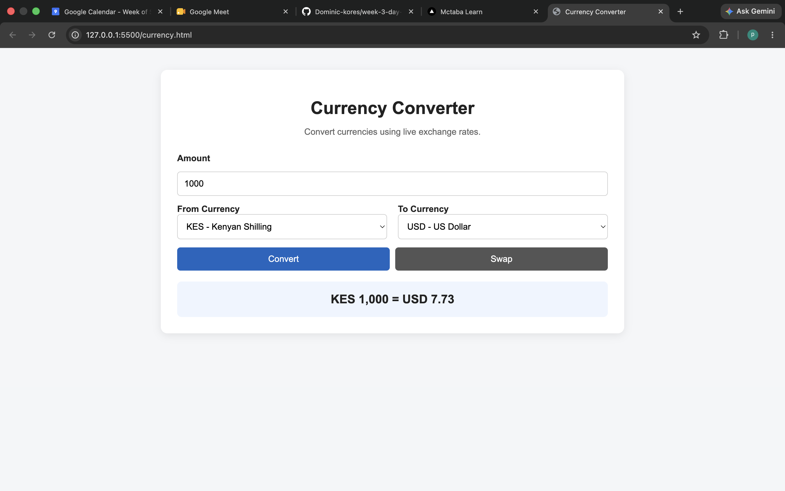
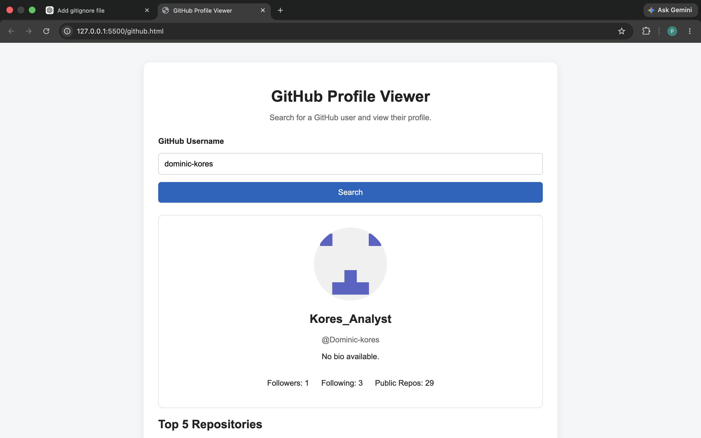
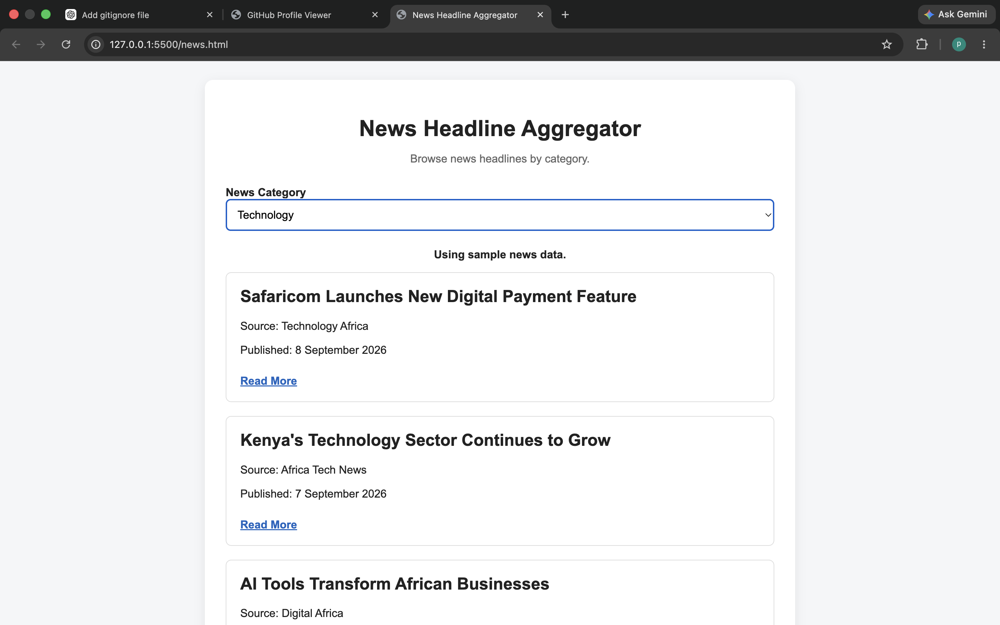

# Week 3 Day 3 – API Integration

## Overview

This project contains three API-based JavaScript mini-apps:

1. Currency Converter
2. GitHub Profile Viewer
3. News Headline Aggregator

The project demonstrates `fetch()`, `async/await`, JSON, DOM manipulation, error handling, and loading states.

---

## Live Pages

- [Currency Converter](https://Dominic-kores.github.io/week-3-day-3-assignment/currency.html)
- [GitHub Profile Viewer](https://Dominic-kores.github.io/week-3-day-3-assignment/github.html)
- [News Aggregator](https://Dominic-kores.github.io/week-3-day-3-assignment/news.html)

---

## Features

### Currency Converter
- Converts KES, USD, EUR, GBP, TZS, and UGX
- Uses live exchange rates
- Includes Convert and Swap buttons
- Handles API errors and loading states

### GitHub Profile Viewer
- Search by GitHub username
- Displays avatar, bio, followers, following, and repositories
- Shows top 5 repositories by stars
- Handles 404 errors

### News Aggregator
- Displays news headlines
- Filters by Technology, Business, Sports, and Health
- Shows source, date, and Read More link
- Supports API or sample data

---

## Technologies Used

- HTML
- CSS
- JavaScript
- Fetch API
- Async/Await
- Git & GitHub

---
## Screenshots

### Currency Converter


### GitHub Profile Viewer


### News Aggregator


---

## Project Structure

```text
week-3-day-3-assignment/
├── currency.html
├── currency.js
├── github.html
├── github.js
├── news.html
├── news.js
├── styles.css
├── screenshots
└── README.md


## Author

**Dominic Kores**